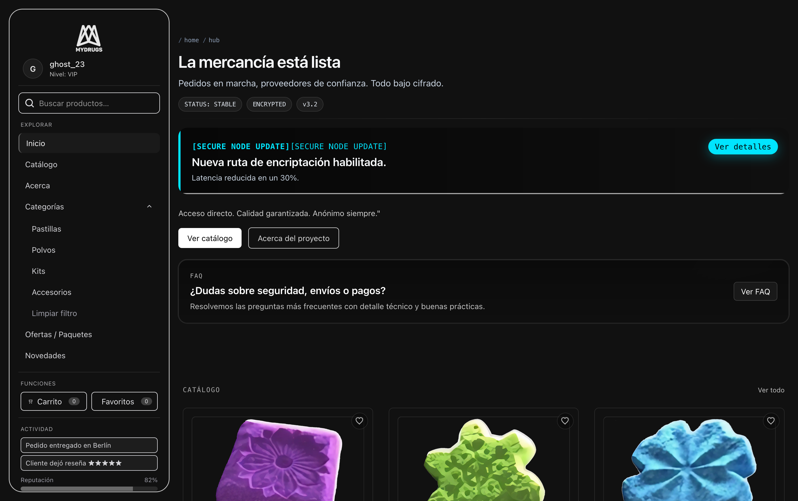

<<<<<<< HEAD

# 💊 MyDrugs – Modern Recreation

_Recreación moderna e interactiva de la ficticia tienda online **MyDrugs** inspirada en la serie **How to Sell Drugs Online (Fast)**.  
Una experiencia visual que combina narrativa en tiempo real, estética clandestina y tecnologías modernas._

---

## ✨ Características

- 🎯 **Diseño responsive** adaptado a móviles y desktop.
- 🖥 **Sidebar fijo** para navegación rápida y minimalista.
- 📦 **Catálogo interactivo** con productos destacados y efectos hover.
- 📡 **Elementos narrativos en tiempo real**: mensajes del sistema, estado de red, proveedores verificados.
- 🛡 **Modo Panic** para cambiar a una interfaz segura con un clic (concepto narrativo).
- 🎨 Estética inspirada en la **dark web**, pero con un look pulido y actual.

---

## 🖼 Vista previa

> _Capturas de pantalla del prototipo inicial de la página._



---

## 🛠 Tecnologías utilizadas

- **Next.js 14+**
- **Tailwind CSS**
- **shadcn/ui**
- **Lucide Icons**

---

## 🚀 Instalación y uso

```bash
# Clonar repositorio
git clone https://github.com/tuusuario/mydrugs-ui.git

# Entrar al proyecto
cd mydrugs-ui

# Instalar dependencias
npm install

# Iniciar servidor de desarrollo
npm run dev
```

📜 Licencia

Este proyecto está bajo la licencia Creative Commons BY-NC-SA 4.0.
No se permite el uso comercial. Las obras derivadas deben compartirse bajo la misma licencia.
Más información en el archivo LICENSE.

⚠️ Aviso

Este proyecto es únicamente con fines educativos y recreativos.
No promueve ni facilita actividades ilegales. Todo el contenido es ficticio e inspirado en una obra de ficción.

💡 Créditos

Inspirado por la serie How to Sell Drugs Online (Fast) de Netflix.

# Desarrollado por Mukinma.
